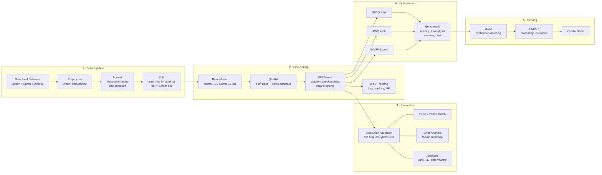

# LLM SQL Fine-Tune

Fine-tune a small open-source LLM (7–8B parameters) for **Text-to-SQL** using QLoRA, then optimize and serve it with production-grade inference.

This project covers the full LLM lifecycle: dataset curation, parameter-efficient fine-tuning, rigorous evaluation with ablation studies, inference optimization (quantization + batching), and a production FastAPI endpoint.

## Architecture



## Data Strategy

Training uses two datasets to balance quality and scale, with a clean evaluation setup:

| Split | Source | Size (approx) | Purpose |
|-------|--------|:-:|---------|
| **Train** | Spider train + Gretel synthetic (complex only) | ~62K | QLoRA fine-tuning |
| **Val** | Held out from train pool, split by schema | ~7K | Loss monitoring, early stopping |
| **Test** | Spider dev (official, untouched) | 1,034 | Final execution accuracy — zero leakage |

**Why this setup?**
- **Spider train** (8.6K examples, 146 databases) provides real cross-domain Text-to-SQL pairs with SQLite databases for execution accuracy testing.
- **Gretel synthetic_text_to_sql** (~60K filtered) adds scale with complex queries — JOINs, subqueries, aggregations, window functions. Zero benchmark contamination since it's independently generated.
- **Spider dev** (20 completely unseen databases) is held out strictly for final evaluation. Train/dev database schemas are disjoint by design.

## Quick Start

```bash
# Install
make install-dev

# Prepare data
make data

# Train (QLoRA fine-tune)
make train

# Evaluate
make evaluate

# Serve the API
make serve
```

## Results

> _Results will be populated as training runs complete. Evaluated on Spider dev (unseen schemas)._

| Model | Method | Exec Accuracy | Exact Match | Latency (ms) | Memory (GB) | Cost / 1K queries |
|-------|--------|:---:|:---:|:---:|:---:|:---:|
| Mistral 7B | Zero-shot | — | — | — | — | — |
| Mistral 7B | 3-shot | — | — | — | — | — |
| Mistral 7B | QLoRA r=16 | — | — | — | — | — |
| Mistral 7B | QLoRA r=32 | — | — | — | — | — |
| + GPTQ 4-bit | QLoRA r=32 | — | — | — | — | — |
| + AWQ 4-bit | QLoRA r=32 | — | — | — | — | — |

## Project Structure

```
├── configs/             # Training & serving YAML configs
│   ├── training/
│   └── serving/
├── src/                 # Library code
│   ├── data/            # Download, preprocess, format, split
│   ├── training/        # QLoRA trainer, config, callbacks
│   ├── evaluation/      # SQL execution, metrics, error analysis
│   ├── optimization/    # GPTQ, AWQ, GGUF quantization + benchmarks
│   └── serving/         # FastAPI app, schemas, middleware
├── scripts/             # CLI entry points
├── notebooks/           # EDA & analysis notebooks
├── experiments/         # Run logs & saved results
├── tests/               # Unit & integration tests
└── demo/                # Gradio interactive demo
```

## Tech Stack

- **Fine-tuning**: transformers, peft, trl, bitsandbytes, datasets
- **Tracking**: Weights & Biases
- **Quantization**: auto-gptq, autoawq, llama-cpp-python
- **Serving**: vLLM, FastAPI, uvicorn
- **Demo**: Gradio

## License

MIT
